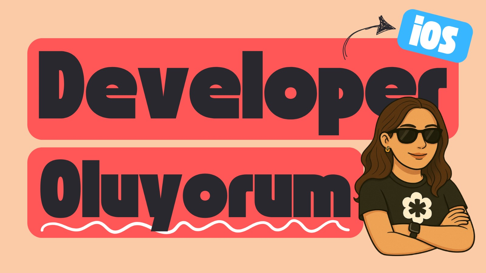

# 🍏 iOS Developer Oluyorum

> “Kursu bitirdim ama sonra ne olacak?”  
> Eğer bu soru senin de kafanı kurcalıyorsa, yalnız değilsin. Bu seri senin için.

---

## 🎯 Neden Bu Seriyi Yapıyoruz?

Birçok kişi iOS kurslarını ya da bootcamp'leri tamamladığında “artık hazırım” hissiyle yola çıkıyor.  
Ama gerçek projelere adım attıklarında bambaşka sorularla karşılaşıyorlar:

- “Bu özelliği nasıl entegre ederim?”
- “MVVM mimarisini nereye kadar uygulamalıyım?”
- “Bu bug neden oluyor, çözümü neden hiç anlatılmadı?”
- “Kamera erişimini neden alamıyorum?”
- “Firestore verimi neden göstermiyor?”

İşte bu seri, bu soruları yaşayan herkes için var.  
Amacımız, sadece teknik bilgi sunmak değil; **görünmeyen detayları görünür kılmak.**

---

## 🔍 Seride Ne Var?

Bu repo, **Zamansız iOS canlı yayın serisine** ait tüm içerikleri kapsar. Her hafta, işlenen konulara dair:

- 📝 Ders notları  
- 💻 Örnek projeler / kodlar  
- 📚 Önerilen kaynaklar  
- ✍️ O haftaya ait Medium yazısı  
- 💡 Özgün ipuçları & fark edilmeyen detaylar  

hepsi bu yapıda yer alacak.

---

## 🧭 Serinin Odağı

Bu seri yalnızca **trend teknolojilere** değil, seni gerçekten ileri taşıyacak olan **temellere** odaklanır:

- MVVM + UIKit + Firestore  
- Kamera ve galeri entegrasyonları  
- Widget geliştirme  
- Dark/Light mod performansı  
- Store'a uygulama gönderme süreci  
- SwiftUI & UIKit birlikte kullanım  
- Veritabanı tasarımı  
- Test yazımı & hata ayıklama bakış açısı  
- ve çok daha fazlası...

---

## 🤝 Kimlerle Yapıyoruz?

Bu seriyi  
**Multi bakış açısı** ve **multi deneyim** mottosuyla ilerleteceğiz!  

Burada tek bir yol anlatılmayacak, yollar karşılaştırılacak ve birlikte keşfedilecek.  
Ayrıca her yayında, sektörde aktif olarak çalışan **senior iOS geliştiricilerle** birlikte olacağız.  

Her biri kendi tecrübelerini, hatalarını, başarılarını ve geliştirdiği çözümleri bizimle paylaşacak.  
Gerçek dünyadan örneklerle, tek başına öğrenmenin ötesine geçeceğiz.  
**Tek bir yol yok, tek bir doğrusu yok — bu yüzden birden fazla perspektifi bir araya getiriyoruz.**

### Ve işin en heyecanlı kısmı?

Her yayında sektörden farklı **senior iOS geliştiriciler** bizlerle olacak!  
Yani bu seride sadece teoriler yok;  
bolca gerçek hayat hikayesi,  
“ben de zamanında bu hatayı yaptım” itirafları,  
kısayollar, ipuçları ve bol kahkahalı anılar var 😄  

Bu sadece bir yayın değil — **deneyimlerin buluştuğu, bilgilerin paylaşıldığı ve birlikte büyüdüğümüz canlı bir topluluk.**

---

## 🚀 Katılım & Takip

Her hafta yayınlar:

- 🎥 YouTube üzerinden **canlı** olarak  
- 📂 Bu repoda **düzenli olarak içerik** şeklinde  
- ✍️ Medium’da **haftalık yazı** olarak  

yayınlanacaktır.

Siz de:

- Repo'yu ⭐️ star'layabilir  
- Yeni haftaları takip edebilir  
- Kendi katkınızı sunabilirsiniz

---

## 📩 İletişim

Görüşlerinizi, katkılarınızı ve önerilerinizi bizimle paylaşmaktan çekinmeyin!

> Bu yolculuk tek kişilik değil.  
> Bilmediğimizi birlikte fark edeceğiz.

---

💚 “Ben bunu bilmediğimi bile bilmiyordum” diyorsan, doğru yerdesin.  
**Haydi devam edelim!**

